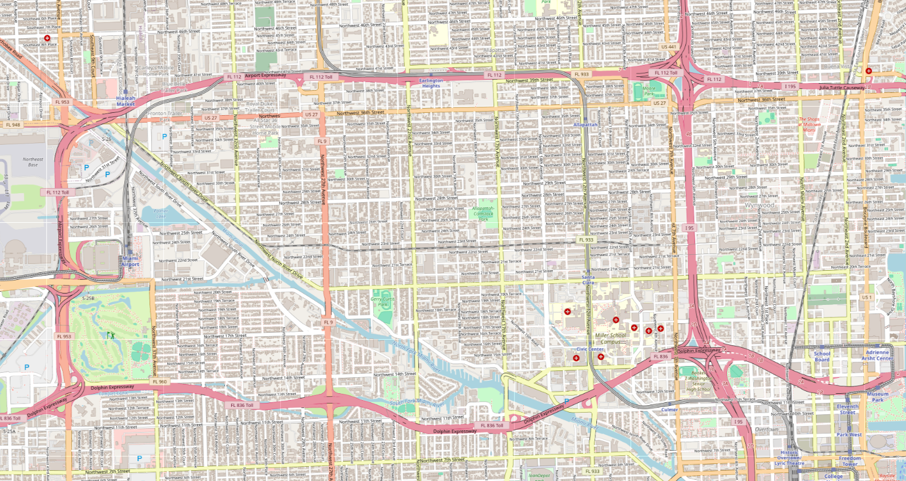

# 📊 Building a Database of Simulated Driver Behaviors Using the SUMO Simulator

<div align="center">
  
</div>

## 📂 Repository Organization
---------------
    ```
    /Building a Database of Simulated Driver Behaviors Using the SUMO Simulator
    │
    ├── README.md                          # Project description and usage instructions
    │
    │
    ├── /Datasets_SUMO_Driver_behavior          # Raw datasets generated from SUMO simulations
    │   ├── Dataset_Miami_800V_IDM_warningcollect
    │   │   ├── 1800V_DS_Export_dataframe_V1.csv    # Raw dataset of 1800 vehicles for each behavior
    │   │   ├── 1800V_DS_Separated_warning_V1.csv  # Warning dataset of 1800 vehicles for each behavior
    │   │   └── 1800V_DS_Sum_warning_V1.csv        # Warning dataset with sums of 1800 vehicles for each behavior
    │   │
    │   ├── Dataset_Miami_1800V_IDM_warningcollect
    │   │   ├── 1800V_DS_Export_dataframe_V1.csv    # Raw dataset of 1800 vehicles for each behavior
    │   │   ├── 1800V_DS_Separated_warning_V1.csv   # Warning dataset of 1800 vehicles for each behavior
    │   │   └── 1800V_DS_Sum_warning_V1.csv         # Warning dataset with sums of 1800 vehicles for each behavior
    │   │
    │   └── Plotting_Output_dataset                 # Output figures and plots from datasets
    │
    ├── /MLP_SVM_KNN_Driver_Behavior       # Machine learning models for driver behavior classification
    │   ├── Dataset_Miami_800V_IDM_warningcollect  # Dataset used for training ML models
    │   ├── Datasets_SUMO_Driver_behavior         # Additional datasets for model testing
    │   └── Plotting_Output_dataset               # Plots of model outputs and evaluations
    │
    ├── /Plot_dataset                      # Scripts and figures for dataset visualization
    │   ├── Figures                        # Visual outputs from data plotting
    │   └── final_code_to_show_miami_sumo_dataset_mlp_svm_knn_driver_behavior.py
    │
    ├── /Simulation1_Miami_1800V_warningcollect   # First simulation scenario (1800 vehicles per behavior: Slow, Normal, Dangerous)
    │   ├── Output_Dataset      # Dataset collected during Simulation 1
    │   ├── Output_collision    # Collision data collected during Simulation 1
    │   ├── SUMO_Networks       # SUMO network, routes, and driver behaviors
    │   ├── utils               # Scripts for data collection, warning extraction, and plotting
    │   └── main.py             # Main simulation script (run with `python main.py`)
    │
    ├── /Simulation2_Miami_800V_warningcollect    # Second simulation scenario (800 vehicles per behavior: Slow, Normal, Dangerous)
    │   ├── Output_Dataset     # Dataset collected during Simulation 2
    │   ├── Output_collision   # Collision data collected during Simulation 2
    │   ├── SUMO_Networks      # SUMO network, routes, and driver behaviors
    │   ├── utils              # Scripts for data collection, warning extraction, and plotting
    │   └── main.py            # Main simulation script (run with `python main.py`)
    │
    ├── Miami1.png             # Miami route map
    ├── Miami2.png             # Miami network map
    └── published_paper.pdf    # The published scientific article

    ```


## 📄 Project Description
This project simulates the behavior of drivers in a city using the SUMO simulator, generating datasets that capture various driving behaviors (slow, normal, dangerous). The datasets are used for further analysis and to train machine learning models (MLP, SVM, KNN) for behavior classification.

## 🚀 Getting Started
1. Clone the repository: 
   ```bash
   git clone https://github.com/your-repository-url
   ```
2. **Build and Installation SUMO and NETEDIT**. For installation instructions, see the [Build and Installation section](https://sumo.dlr.de/docs/Installing/index.html)

3. **Installation NETEDIT**. For installation instructions, see the [Usage Description](https://sumo.dlr.de/docs/Netedit/index.html)

4. Navigate to the simulation directory:
   ```bash
   cd Simulation1_Miami_1800V_warningcollect

   or
   
   cd Simulation2_Miami_800V_warningcollect
   ```

5. Run the simulation using:
   ```bash
   python main.py
   ```


---


## 📊 Machine Learning Models
The `MLP_SVM_KNN_Driver_Behavior` directory contains machine learning models for classifying driver behavior based on the generated datasets. You can use the provided datasets to train and evaluate models.

## 📈 Visualization
Visualization scripts and output plots can be found in the `Plot_dataset directory`. These are useful for analyzing the results of simulations and machine learning models.

## 📚 Datasets
The datasets in the `Datasets_SUMO_Driver_behavior` directory include both raw data and processed warning data for different simulation scenarios.

## 🌍 Route and Network Maps
The `Miami1.png` and `Miami2.png` images provide visual representations of the simulation's route and network maps.


## 📚 References
Below are the references used in the project.

```bibtex

@inproceedings{chah2024building, 
        title={Building a Database of Simulated Driver Behaviors Using the SUMO Simulator}, 
        author={Chah, Badreddine and Lombard, Alexandre and Mualla, Yazan and Bkakria, Anis and Abbas-Turki, Abdeljalil and Yaich, Reda}, 
        booktitle={Intelligent Systems Conference}, 
        pages={536--555}, 
        year={2024}, 
        organization={Springer} 
    }
