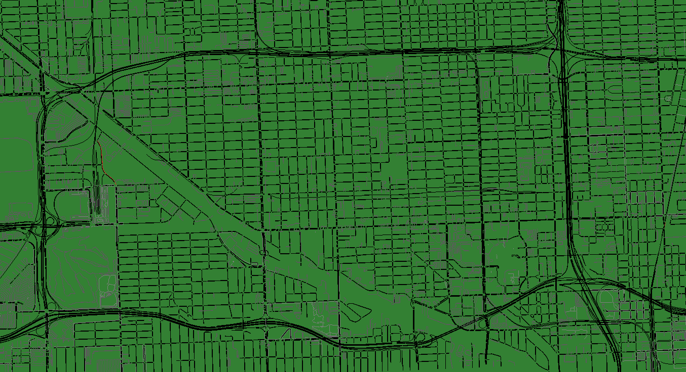

# 📊 Building a Database of Simulated Driver Behaviors Using the SUMO Simulator



## 📂 Repository Organization
---------------
/Building a Database of Simulated Driver Behaviors Using the SUMO Simulator
│
├── README.md                          # Project description and usage instructions
│
│
├── /Datasets_SUMO_Driver_behavior          # Raw datasets generated from SUMO simulations
│   ├── Dataset_Miami_800V_IDM_warningcollect
│   │   ├── 1800V_DS_Export_dataframe_V1.csv    # Raw dataset of 1800 vehicles for each behavior
│   │   ├── 1800V_DS_Separated_warning_V1.csv  # Warning dataset of 1800 vehicles for each behavior
│   │   └── 1800V_DS_Sum_warning_V1.csv        # Warning dataset with sums of 1800 vehicles for each behavior
│   │
│   ├── Dataset_Miami_1800V_IDM_warningcollect
│   │   ├── 1800V_DS_Export_dataframe_V1.csv    # Raw dataset of 1800 vehicles for each behavior
│   │   ├── 1800V_DS_Separated_warning_V1.csv   # Warning dataset of 1800 vehicles for each behavior
│   │   └── 1800V_DS_Sum_warning_V1.csv         # Warning dataset with sums of 1800 vehicles for each behavior
│   │
│   └── Plotting_Output_dataset                 # Output figures and plots from datasets
│
├── /MLP_SVM_KNN_Driver_Behavior       # Machine learning models for driver behavior classification
│   ├── Dataset_Miami_800V_IDM_warningcollect  # Dataset used for training ML models
│   ├── Datasets_SUMO_Driver_behavior         # Additional datasets for model testing
│   └── Plotting_Output_dataset               # Plots of model outputs and evaluations
│
├── /Plot_dataset                      # Scripts and figures for dataset visualization
│   ├── Figures                        # Visual outputs from data plotting
│   └── final_code_to_show_miami_sumo_dataset_mlp_svm_knn_driver_behavior.py
│
├── /Simulation1_Miami_1800V_warningcollect   # First simulation scenario (1800 vehicles per behavior: Slow, Normal, Dangerous)
│   ├── Output_Dataset      # Dataset collected during Simulation 1
│   ├── Output_collision    # Collision data collected during Simulation 1
│   ├── SUMO_Networks       # SUMO network, routes, and driver behaviors
│   ├── utils               # Scripts for data collection, warning extraction, and plotting
│   └── main.py             # Main simulation script (run with `python main.py`)
│
├── /Simulation2_Miami_800V_warningcollect    # Second simulation scenario (800 vehicles per behavior: Slow, Normal, Dangerous)
│   ├── Output_Dataset     # Dataset collected during Simulation 2
│   ├── Output_collision   # Collision data collected during Simulation 2
│   ├── SUMO_Networks      # SUMO network, routes, and driver behaviors
│   ├── utils              # Scripts for data collection, warning extraction, and plotting
│   └── main.py            # Main simulation script (run with `python main.py`)
│
├── Miami1.png             # Miami route map
└── Miami2.png             # Miami network map


---

## 🚀 Getting Started

To get started with the project:

1. **Build and Installation SUMO and NETEDIT**. For installation instructions, see the [Build and Installation section](#-Build-and-Installation-SUMO)
2. Choose a simulation (Simulation1 or Simulation2).
3. Run the simulation using:
    ```bash
    python main.py
    ```

---

<a href="https://sumo.dlr.de/docs"><p align="center"></p></a>

What is SUMO
------------

["Simulation of Urban MObility" (SUMO)](https://sumo.dlr.de/) is an open source,
highly portable, microscopic traffic simulation package designed to handle
large road networks and different modes of transport.

<p align="center"></p>

It is mainly developed by employees of the [Institute of Transportation Systems
at the German Aerospace Center](https://www.dlr.de/ts/en/).


Build and Installation SUMO 
----------------------

For Windows we provide pre-compiled binaries and CMake files to generate Visual Studio projects.
If you want to develop under Windows, please also clone the dependent libraries using:

```
git clone --recursive https://github.com/DLR-TS/SUMOLibraries
```

If you're using Linux, you should have a look whether your distribution already contains sumo.
There is also a [ppa for ubuntu users](https://launchpad.net/~sumo) and an
[open build service instance](https://build.opensuse.org/project/show/science:dlr).
If you want to build SUMO yourself, the steps for ubuntu are:

```
sudo apt-get install cmake python g++ libxerces-c-dev libfox-1.6-dev libgdal-dev libproj-dev libgl2ps-dev swig
cd <SUMO_DIR> # please insert the correct directory name here
export SUMO_HOME="$PWD"
cmake -B build .
cmake --build build -j$(nproc)
```

For [detailed build instructions, have a look at our Documentation](https://sumo.dlr.de/docs/Developer/Main.html#build_instructions).


SUMO Documentation
---------------
- The main documentation is at [sumo.dlr.de/docs](https://sumo.dlr.de/docs). Note that this tracks the [development version](https://sumo.dlr.de/docs/FAQ.html#why_does_sumo_not_behave_as_documented_in_this_wiki).
- A mirror of the main documentation is at [sumo.sourceforge.net/docs](https://sumo.sourceforge.net/docs).
- An offline version of the documentation is part of every release and can be accessed via `docs/userdoc/index.html`.


## 📚 References
Below are the references used in the project.

```bibtex

@inproceedings{chah2024building, 
        title={Building a Database of Simulated Driver Behaviors Using the SUMO Simulator}, 
        author={Chah, Badreddine and Lombard, Alexandre and Mualla, Yazan and Bkakria, Anis and Abbas-Turki, Abdeljalil and Yaich, Reda}, 
        booktitle={Intelligent Systems Conference}, 
        pages={536--555}, 
        year={2024}, 
        organization={Springer} 
    }
