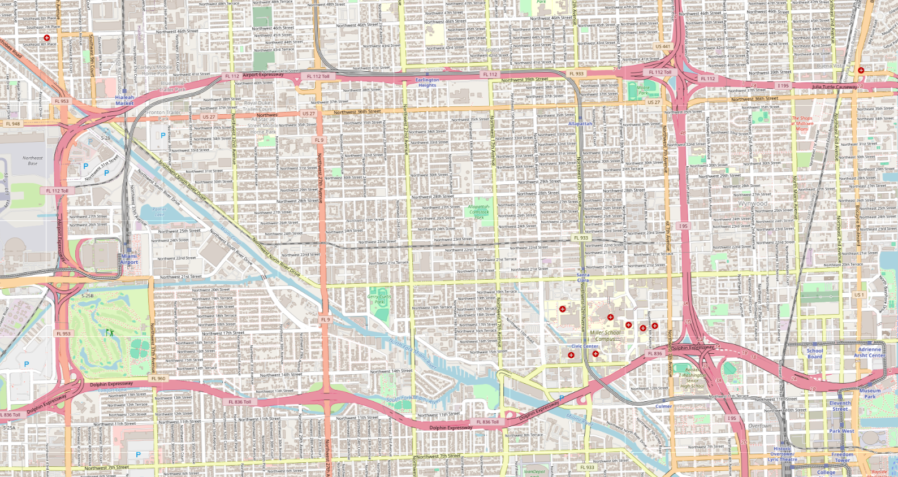

# 📊 Building a Database of Simulated Driver Behaviors Using the SUMO Simulator

<div align="center">
  
</div>


## 📄 Project Description

This project focuses on classifying driver behaviors to enhance road safety in smart cities and support **Pay-As-You-Drive (PAYD)** insurance services. Using the **SUMO (Simulation of Urban Mobility)** simulator, we generated a database of simulated driving styles based on the **Intelligent Driver Model (IDM)**. The simulated driving behaviors are categorized into three classes:

- Slow
- Normal
- Dangerous

The simulations were performed on a realistic map of **Miami**, which includes various road types and traffic signs to create realistic driving scenarios. Through **TraCI (Traffic Control Interface)**, we collected detailed vehicle data, including:

- Vehicle trajectories
- Traffic violation alerts (such as speeding, red-light running, etc.)

This data was then used to train and evaluate four machine learning models to classify driver behaviors:

1. **Gradient Boosted Decision Trees (GBDT)**
2. **K-Nearest Neighbors (KNN)**
3. **Multi-layer Perceptron (MLP)**
4. **Support Vector Machines (SVM)**

The goal of the project is to demonstrate the feasibility of the **AlertDang Driver Profiling** method, which aims to detect risky driving patterns in real-time and support applications such as road safety monitoring and dynamic insurance pricing.

## Deliverables:
- Full source code for simulation, data collection, and machine learning pipelines.
- A labeled dataset of simulated driver behaviors.
- Performance evaluation of the implemented models.
- Discussion of the method’s benefits, current limitations, and possible future improvements.


## 🚀 Getting Started
1. Clone the repository: 
   ```bash
   git clone https://github.com/your-repository-url
   ```
2. **Build and Installation SUMO and NETEDIT**. For installation instructions, see the [Build and Installation section](https://sumo.dlr.de/docs/Installing/index.html)

3. **Installation NETEDIT**. For installation instructions, see the [Usage Description](https://sumo.dlr.de/docs/Netedit/index.html)

4. Navigate to the simulation directory:
   ```bash
   cd Simulation1_Miami_1800V_warningcollect

   or
   
   cd Simulation2_Miami_800V_warningcollect
   ```

5. Run the simulation using:
   ```bash
   python main.py
   ```
---


## 📊 Machine Learning Models
The `MLP_SVM_KNN_Driver_Behavior` directory contains machine learning models for classifying driver behavior based on the generated datasets. You can use the provided datasets to train and evaluate models.

## 📈 Visualization
Visualization scripts and output plots can be found in the `Plot_dataset directory`. These are useful for analyzing the results of simulations and machine learning models.

## 📚 Datasets
The datasets in the `Datasets_SUMO_Driver_behavior` directory include both raw data and processed warning data for different simulation scenarios.

## 🌍 Route and Network Maps
The `Miami1.png` and `Miami2.png` images provide visual representations of the simulation's route and network maps.


## 📚 References
Below are the references used in the project.

```bibtex

@inproceedings{chah2024building, 
        title={Building a Database of Simulated Driver Behaviors Using the SUMO Simulator}, 
        author={Chah, Badreddine and Lombard, Alexandre and Mualla, Yazan and Bkakria, Anis and Abbas-Turki, Abdeljalil and Yaich, Reda}, 
        booktitle={Intelligent Systems Conference}, 
        pages={536--555}, 
        year={2024}, 
        organization={Springer} 
    }

## 📂 Repository Organization
---------------
    ```
    /Building a Database of Simulated Driver Behaviors Using the SUMO Simulator
    │
    ├── README.md                          # Project description and usage instructions
    │
    │
    ├── /Datasets_SUMO_Driver_behavior          # Raw datasets generated from SUMO simulations
    │   ├── Dataset_Miami_800V_IDM_warningcollect
    │   │   ├── 1800V_DS_Export_dataframe_V1.csv    # Raw dataset of 1800 vehicles for each behavior
    │   │   ├── 1800V_DS_Separated_warning_V1.csv  # Warning dataset of 1800 vehicles for each behavior
    │   │   └── 1800V_DS_Sum_warning_V1.csv        # Warning dataset with sums of 1800 vehicles for each behavior
    │   │
    │   ├── Dataset_Miami_1800V_IDM_warningcollect
    │   │   ├── 1800V_DS_Export_dataframe_V1.csv    # Raw dataset of 1800 vehicles for each behavior
    │   │   ├── 1800V_DS_Separated_warning_V1.csv   # Warning dataset of 1800 vehicles for each behavior
    │   │   └── 1800V_DS_Sum_warning_V1.csv         # Warning dataset with sums of 1800 vehicles for each behavior
    │   │
    │   └── Plotting_Output_dataset                 # Total Warning dataset with of 1800 /800 vehicles for each behavior
    │
    ├── /MLP_SVM_KNN_Driver_Behavior       # Machine learning models for driver behavior classification
    │   ├── Dataset_Miami_800V_IDM_warningcollect  # Dataset used for training ML models
    │   ├── Datasets_SUMO_Driver_behavior         # Additional datasets for model testing
    │   └── Plotting_Output_dataset               # Plots of model outputs and evaluations
    │
    ├── /Plot_dataset                      # Scripts and figures for dataset visualization
    │   ├── Figures                        # Visual outputs from data plotting
    │   └── final_code_to_show_miami_sumo_dataset_mlp_svm_knn_driver_behavior.py
    │
    ├── /Simulation1_Miami_1800V_warningcollect   # First simulation scenario (1800 vehicles per behavior: Slow, Normal, Dangerous)
    │   ├── Output_Dataset      # Dataset collected during Simulation 1
    │   ├── Output_collision    # Collision data collected during Simulation 1
    │   ├── SUMO_Networks       # SUMO network, routes, and driver behaviors
    │   ├── utils               # Scripts for data collection, warning extraction, and plotting
    │   └── main.py             # Main simulation script (run with `python main.py`)
    │
    ├── /Simulation2_Miami_800V_warningcollect    # Second simulation scenario (800 vehicles per behavior: Slow, Normal, Dangerous)
    │   ├── Output_Dataset     # Dataset collected during Simulation 2
    │   ├── Output_collision   # Collision data collected during Simulation 2
    │   ├── SUMO_Networks      # SUMO network, routes, and driver behaviors
    │   ├── utils              # Scripts for data collection, warning extraction, and plotting
    │   └── main.py            # Main simulation script (run with `python main.py`)
    │
    ├── Miami1.png             # Miami route map
    ├── Miami2.png             # Miami network map
    └── published_paper.pdf    # The published scientific article

    ```

